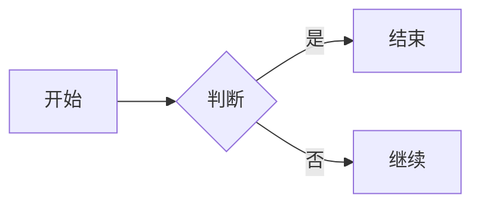

# MarbyMarkdown 使用指南

---

## 简介

MarbyMarkdown 是一个跨平台的、即时渲染桌面端 Markdown 编辑器，提供类似 Typora 的编辑体验。它集成了强大的 AI 功能，让您的写作更加高效！

---

## 界面布局

MarbyMarkdown 采用三栏式布局设计：

```
┌─────────────────────────────────────────────────────────┐
│ 标题栏                          │
├─────────────────────────────────────────────────────────┤
│           │              │                    │
│           │              │                    │
│           │              │                    │
│           │              │                    │
│  大纲侧边栏 │   编辑器区域   │   AI 聊天侧边栏   │
│           │              │                    │
│           │              │                    │
│           │              │                    │
├─────────────────────────────────────────────────────────┤
│ 状态栏                          │
└─────────────────────────────────────────────────────────┘
```

### 左侧：大纲侧边栏

- 显示当前文档的标题结构
- 点击可以快速跳转到对应的位置
- 可以通过状态栏左侧的按钮开关
- 支持平滑的滑入滑出动画

### 中间：编辑器区域

- WYSIWYG（所见即所得）编辑体验
- 支持 Markdown 即时渲染
- 支持多标签页同时打开多个文件
- 可以切换源码模式查看原始 Markdown

### 右侧：AI 聊天侧边栏

- 基于当前文件上下文的 AI 对话
- 支持流式输出，显示思考状态
- 可以全屏显示
- 每次对话后 AI 自动生成本次会话的标题

---

## 快速开始

### 打开文件夹

1. 点击菜单 → 文件 → 打开文件夹
2. 选择您想要编辑的文件夹
3. 文件树会显示在左侧边栏中

### 创建新文件

1. 点击菜单 → 文件 → 新建文件
2. 或使用快捷键 `Ctrl + N`
3. 输入文件名（需要包含 .md 后缀）
4. 按回车确认

### 打开文件

1. 在左侧文件树中点击文件名
2. 文件会在新标签页中打开
3. 支持同时打开多个文件
4. 会自动恢复上次关闭时打开的文件

### 切换视图

#### 大纲侧边栏

- 方法一：点击状态栏左侧的"列表"图标
- 方法二：使用快捷键 `Ctrl + Shift + O`
- 侧边栏会从左侧平滑滑入

#### AI 聊天侧边栏

- 前提：需要先在设置中启用 AI 聊天功能
- 方法：点击状态栏右侧的"AI 聊天"图标
- 侧边栏会从右侧平滑滑入

#### 源码模式

- 方法一：点击状态栏的"源码"图标
- 方法二：使用快捷键 `Ctrl + /`

---

## 功能详解

### 自动保存功能

MarbyMarkdown 提供强大的自动保存机制：

#### 配置自动保存

1. 打开菜单 → 设置 → 其他设置
2. 找到"自动保存"选项
3. 可以：
   - 启用/禁用自动保存
   - 设置保存间隔（秒）
   - 启用自动保存前的提示弹窗
   - 启用回滚功能（可以恢复到自动保存前的内容）

#### 使用回滚功能

当自动保存启用且有回滚内容时：
1. 状态栏会显示"回滚"按钮（刷新图标）
2. 点击即可恢复到上次自动保存前的内容
3. 回滚后内容会标记为未保存，您可以选择是否保存

#### 手动保存

- 快捷键：`Ctrl + S`
- 或点击菜单 → 文件 → 保存
- 状态栏会显示保存状态

### AI 功能详解

MarbyMarkdown 集成了全面的 AI 辅助功能，包括续写、聊天和优化。

#### 全局 AI 配置

首先需要配置 AI 服务：

1. 打开菜单 → 设置 → 拓展功能 → 全局 AI 配置
2. 选择服务提供商（OpenAI、Claude、Gemini、Ollama 或自定义）
3. 配置 API Key 和 Base URL
4. 选择使用的模型
5. 调整温度参数（影响回答的创造性）

#### AI 续写功能

在编辑器中，AI 可以智能续写您的内容：

1. 确保已配置 AI 服务
2. 在设置中启用"AI 续写"功能
3. 编辑时 AI 会根据上下文自动续写
4. 可以配置续写的行为（长度、风格等）

#### AI 优化功能

选中一段文字，可以让 AI 进行优化：

1. 选中想要优化的文本
2. 在设置中启用"AI 优化"功能
3. 可以选择不同的优化风格：
   - 正式风格
   - 轻松/口语风格
   - 简洁风格
   - 自定义风格

#### AI 聊天功能（核心功能）

与 AI 进行基于当前文件的对话：

##### 打开聊天

1. 确保已在设置中启用"AI 聊天"
2. 点击状态栏右侧的 AI 图标
3. 侧边栏从右侧滑出

##### 聊天界面

- 顶部显示当前会话标题（由 AI 自动生成）
- 中间是消息列表，显示对话历史
- 底部是输入框，可以发送消息
- 右侧可以打开历史记录面板

##### 新建会话

1. 在聊天界面，点击顶部的"新建会话"按钮（蓝色加号）
2. 或在历史记录面板点击"新建会话"
3. 同一个文件可以创建多个独立的对话

##### 历史记录

1. 点击顶部的"历史记录"图标
2. 面板中显示所有聊天会话
3. 每个会话显示：
   - AI 生成的会话标题
   - 对应的文件名
   - 消息数量
   - 更新时间
4. 点击可以切换到该会话
5. 可以删除不需要的会话

##### 会话标题

AI 每次回复后会自动生成会话标题：
- 标题长度控制在 7-15 个汉字
- 概括本次对话的主要内容
- 标题在 JSON 格式中，不会显示给用户
- 会自动更新会话列表中的标题

##### AI 聊天全屏模式

1. 在聊天界面，点击顶部的"全屏"图标
2. 聊天区域会扩展到 80% 宽度
3. 再次点击可退出全屏
4. 支持流畅的动画效果

##### 查看其他文档的会话

- 可以查看历史记录中其他文档的会话
- 但只能查看，不能继续聊天
- 会显示提示：请先打开对应文件才能继续对话
- 点击"返回当前"可回到当前文件的会话

##### 回到对话底部

- 当聊天内容很长时，会出现"回到最下方"按钮
- 点击可快速滚动到底部

##### 流式输出

- AI 回复支持流式输出，显示实时进度
- 开始前会显示"思考中"状态
- 回复内容逐字显示，提供即时反馈

### 大纲功能

#### 使用大纲

1. 打开大纲侧边栏（状态栏左侧按钮）
2. 会显示当前文档的所有标题
3. 点击标题可以快速定位
4. 标题层级会用缩进表示

#### 标题同步

编辑时，大纲会实时更新：
- 添加新标题会立即显示
- 修改标题文字会同步更新
- 删除标题会从大纲中移除

### 工作区设置

1. 打开菜单 → 设置 → 工作区设置
2. 可以设置：
   - 启动时自动打开的文件夹
   - 是否自动展开侧边栏

### 多标签页

- 每个文件在独立的标签页中打开
- 每个标签页拥有独立的编辑器实例
- 标签页切换时保持编辑状态
- 关闭标签页时会检查是否有未保存的修改
- 可以使用 `Ctrl + Tab` 和 `Ctrl + Shift + Tab` 切换标签

### 状态栏功能

状态栏分为三个区域：

#### 左侧区域
- 大纲开关按钮
- 源码模式开关按钮
- 保存状态显示（已保存/未保存/保存中）

#### 中间区域
- 显示当前版本号

#### 右侧区域
- AI 聊天按钮（如果启用）
- 回滚按钮（如果有回滚内容）
- 自动保存状态显示
- 字符/行数统计（点击可切换）

---

## Markdown 语法支持

### 基础语法

#### 标题

```markdown
# 一级标题
## 二级标题
### 三级标题
#### 四级标题
##### 五级标题
###### 六级标题
```

#### 文字样式

| 效果 | 写法 |
|------|------|
| **粗体** | `**粗体**` |
| *斜体* | `*斜体*` |
| ==高亮== | `==高亮==` |
| ~~删除线~~ | `~~删除线~~` |
| `代码` | `` `代码` `` |

#### 列表

```markdown
- 无序列表项 1
- 无序列表项 2

1. 有序列表项 1
2. 有序列表项 2

- [ ] 待办任务
- [x] 已完成任务
```

#### 链接和图片

```markdown
[链接文字](https://example.com)

```

> 💡 提示：可以直接粘贴图片！

#### 代码块

```markdown
```javascript
function hello() {
  console.log("Hello!");
}
```
```

支持语法高亮的语言包括：JavaScript、Python、Java、C++、HTML、CSS 等。

#### 引用

```markdown
> 这是引用文字
> 
> > 可以嵌套引用
```

#### 表格

```markdown
| 姓名 | 年龄 | 职业 |
|------|------|------|
| 张三 | 25 | 程序员 |
| 李四 | 30 | 设计师 |
```

#### 分割线

```markdown
---
***
___
```

### 拓展功能

#### LaTeX 数学公式

行内公式：
```markdown
$E = mc^2$
```

块级公式：
```markdown
$$
\int_0^\infty e^{-x^2} dx = \frac{\sqrt{\pi}}{2}
$$
```

#### Mermaid 图表

流程图：
```markdown

```

时序图、饼图等都支持！

---

## 主题和外观

### 内置主题

MarbyMarkdown 提供多种内置主题：
- Normal（浅色）
- Normal Dark（深色）
- Crepe（温馨）
- Crepe Dark（深色温馨）
- Frame（简约）
- Frame Dark（深色简约）

切换主题：
1. 打开菜单 → 设置 → 外观
2. 选择您喜欢的主题
3. 立即生效

### 自定义主题

1. 打开菜单 → 设置 → 外观
2. 点击"主题编辑器"
3. 调整各项颜色和样式
4. 保存您的主题
5. 可以导出主题文件分享给他人

### 字体设置

1. 打开菜单 → 设置 → 字体
2. 可以选择：
   - 编辑器字体
   - 字体大小
   - 行高
3. 支持系统已安装的所有字体

---

## 设置详解

### 设置页面导航

设置分为多个类别：
- 工作区设置
- 外观
- 字体
- 拓展功能（AI 相关）
- 文件选项
- 图片配置
- 上传配置
- 快捷键
- 拼写检查
- 语言
- 其他设置
- 关于

### 拓展功能设置

这是最重要的设置类别，包含所有 AI 相关功能：

#### 全局 AI 配置

- **服务提供商**：选择 AI 服务（OpenAI、Claude、Gemini、Ollama、自定义）
- **API Key**：输入您的 API 密钥
- **Base URL**：API 地址
- **Model**：选择使用的模型
- **Temperature**：控制创造性（0-2，越高越随机）

#### AI 续写设置

- 启用/禁用 AI 续写
- 配置续写的具体行为
- 是否包含文档上下文

#### AI 聊天设置

- 启用/禁用 AI 聊天
- 配置聊天行为
- 是否发送当前文档内容给 AI

#### AI 优化设置

- 启用/禁用 AI 优化
- 选择默认优化风格
- 配置自定义风格提示词

---

## 快捷键参考

### 文件操作

| 快捷键 | 功能 |
|--------|------|
| `Ctrl + N` | 新建文件 |
| `Ctrl + O` | 打开文件 |
| `Ctrl + S` | 保存文件 |
| `Ctrl + W` | 关闭标签 |

### 编辑操作

| 快捷键 | 功能 |
|--------|------|
| `Ctrl + C` | 复制 |
| `Ctrl + V` | 粘贴 |
| `Ctrl + X` | 剪切 |
| `Ctrl + Z` | 撤销 |
| `Ctrl + Shift + Z` | 重做 |
| `Ctrl + B` | 加粗 |
| `Ctrl + I` | 斜体 |
| `Ctrl + K` | 插入链接 |

### 视图操作

| 快捷键 | 功能 |
|--------|------|
| `Ctrl + /` | 切换源码模式 |
| `Ctrl + Shift + O` | 切换大纲 |

### 标签切换

| 快捷键 | 功能 |
|--------|------|
| `Ctrl + Tab` | 下一个标签 |
| `Ctrl + Shift + Tab` | 上一个标签 |

### 自定义快捷键

可以在设置 → 快捷键页面自定义快捷键。

---

## 图片处理

### 粘贴图片

直接按 `Ctrl + V` 粘贴图片：
- 自动处理图片路径
- 支持本地上传
- 支持转为 Base64（嵌入文档）
- 支持图床上传

### 图片配置

1. 打开菜单 → 设置 → 图片配置
2. 可以设置默认的图片处理方式
3. 配置图床接口

---

## 语言支持

MarbyMarkdown 支持多语言界面：
- 中文
- 英文
- 日文
- 韩文
- 俄语
- 法语

切换语言：
1. 打开菜单 → 设置 → 语言
2. 选择您喜欢的语言
3. 重启应用后生效

---

## 常见问题

### Q: AI 功能无法使用？

A: 请检查：
1. 是否已在设置中启用对应 AI 功能
2. AI 配置是否正确（API Key、Base URL、模型）
3. 网络连接是否正常

### Q: 聊天标题没有自动生成？

A: AI 标题生成是在每次回复后自动进行的，请确保：
1. AI 正常回复了内容
2. 回复内容末尾包含了 AI 生成的标题（JSON 格式，不会显示给用户）

### Q: 如何为同一个文件创建多个对话？

A: 在聊天界面点击"新建会话"按钮（蓝色加号），或在历史记录面板中点击新建。

### Q: 可以查看其他文档的聊天历史吗？

A: 可以！在历史记录面板可以看到所有会话。查看其他文档的会话时，输入框会禁用，提示需要先打开对应文件才能继续聊天。

### Q: 自动保存会覆盖我的内容吗？

A: 不会！如果启用了"回滚"功能，您可以随时点击状态栏的"回滚"按钮恢复到自动保存前的内容。

### Q: 全屏模式下如何退出？

A: 点击聊天界面顶部的"退出全屏"图标即可。

### Q: 如何切换字符统计和行数统计？

A: 点击状态栏右侧的数字即可切换。

### Q: 文件无法保存？

A: 请检查：
1. 文件是否被其他程序占用
2. 是否有写入权限
3. 磁盘空间是否足够

---

## 版本更新

MarbyMarkdown 会自动检查更新：
- 发现新版本时会提示
- 可以选择立即更新或稍后
- 支持在线更新功能

---

## 关于

查看关于页面：
- 版本信息
- 作者信息
- 项目链接
- 开源协议

---

## 获取帮助

如有问题，请：
1. 查看本文档
2. 访问项目 GitHub 仓库
3. 提交 Issue
4. 加入用户群讨论

祝您使用 MarbyMarkdown 愉快！✨

---